# W.I.T.N.E.S.S. User Guide

**Web-based Interrogation and Testimony via a Neural Engaged Speech System**

*This User Guide was written collaboratively by Philip Roy and Claude (Anthropic).*

---

## Contents

1. [Overview](#1-overview)
2. [Demonstration](#2-demonstration)
3. [Starting the System](#3-starting-the-system)
4. [Persona File Validation](#4-persona-file-validation)
5. [The Home Page](#5-the-home-page)
6. [Create Persona](#6-create-persona)
   - [Required Fields](#61-required-fields)
   - [Personal and Contact Details](#62-personal-and-contact-details)
   - [Facts to Provide](#63-facts-to-provide)
   - [Optional / Behavioural Fields](#64-optional--behavioural-fields)
   - [Saving (Exporting) the Persona as a File](#65-saving-the-persona-as-a-file)
7. [Edit a Persona](#7-edit-a-persona)
   - [Saving Changes](#71-saving-changes)
   - [Cancelling Edits](#72-cancelling-edits)
8. [Conduct Interview](#8-conduct-interview---loading-a-persona)
   - [Text Mode](#81-conducting-an-interview--text-mode)
   - [Voice Mode](#82-conducting-an-interview--voice-mode)
   - [Ending an Interview](#83-ending-an-interview)
   - [Recommencing an Interview](#84-recommencing-an-interview)
   - [Final Warning Concerning the Transcript](#85-final-warning-concerning-the-transcript)
9. [Admin Tools](#9-admin-tools)
   - [Admin Dashboard](#91-admin-dashboard)
   - [System Check](#92-system-check)
   - [Voice Demonstrations](#93-voice-demonstrations)
   - [Custom Dictionary](#94-custom-dictionary)
10. [Tips for Realistic Interviews](#10-tips-for-realistic-interviews)

---

## 1. Overview

W.I.T.N.E.S.S. is a fully offline AI simulation platform for conducting realistic police witness interviews. It uses a local language model to drive persona responses, with optional voice input and output for fully spoken interviews.

The system is designed for training and practice purposes. Interviewers speak with a virtual witness or suspect whose knowledge, certainty, and personality are defined by a **persona file** — a structured JSON document you create, load, and manage.

<p align="center">
  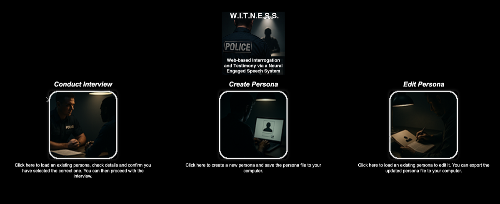
</p>

**Key capabilities:**
- Text-based or voice-based interviews
- Persona-driven responses grounded in structured facts
- New Zealand English conventions throughout (111, metric units, NZ spelling)
- Transcript export to Word (.docx)
- Fully offline — no internet connection required during use

---

## 2. Demonstration

The video shows the final update of the W.I.T.N.E.S.S. system prior to launch, that highlights the administration features and concludes with an audio interview of a witness.

https://vimeo.com/1177174879

---

## 3. Starting the System

### Using the startup script (recommended)

From a terminal, navigate to the W.I.T.N.E.S.S. folder and run:

```bash
./start.sh
```

The script will:
1. Clean Python caches and stop any stray processes
2. Start the Ollama language model daemon
3. Preload the AI model into memory
4. Activate the Python virtual environment
5. Start the FastAPI web server
6. Open your browser automatically at `http://localhost:8010/`

<p align="center">
  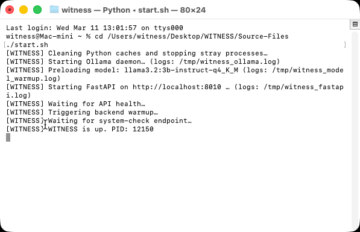
</p>

> **Note:** The first launch after a system restart may take 20–30 seconds while the AI model loads. Subsequent launches within the same session are faster.

### Stopping the system

Close the terminal window running `start.sh`, or press `Ctrl+C`. This stops the FastAPI server. Ollama continues running in the background (this is normal).

---

## 4. Persona File Validation

W.I.T.N.E.S.S. features an inbuilt persona validation system that automatically checks created persona files against a persona template, to make sure the persona file can be used. This process future proofs the system, by making sure to warn you (if you have made changes to the persona template) that you are trying to use a persona file that is either no longer valid or has other issues that need to be resolved.

Any persona file that W.I.T.N.E.S.S. warns you about, can be fixed and updated by using the **Edit Persona** feature, that is discussed in this User Guide.


**Validation results:**

<table>
<colgroup>
  <col width="25%">
  <col width="75%">
</colgroup>
<thead>
<tr>
<th align="left">Outcome</th>
<th align="center">Example</th>
</tr>
</thead>
<tbody>
<tr>
<td>Valid persona — The persona's name, date of birth, and address are shown to confirm you have loaded the correct person.</td>
<td align="center">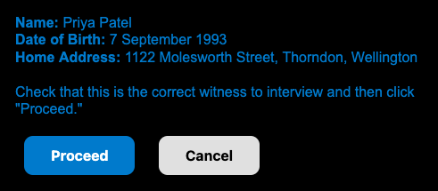</td>
</tr>
<tr>
<td>Valid but incomplete — More than half of the optional fields are empty. The interview can still proceed, but the experience may feel limited.</td>
<td align="center">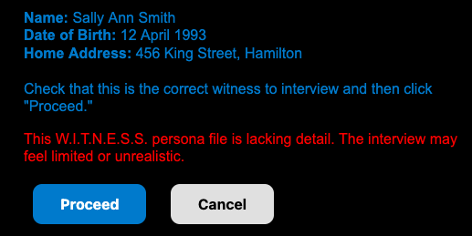</td>
</tr>
<tr>
<td>Possible spelling errors detected — A list of flagged words is shown. Review before proceeding.</td>
<td align="center">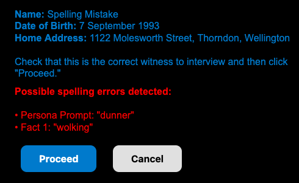</td>
</tr>
<tr>
<td>Invalid file — Not a W.I.T.N.E.S.S. persona, missing required fields, or empty. The interview cannot proceed and the file should be reviewed using the <i>Edit Persona</i> option.</td>
<td align="center">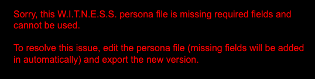</td>
</tr>
</tbody>
</table>

---

## 5. The Home Page

When the system loads, the Home page presents three options:

- **Conduct Interview** — begin a text or audio interview
- **Create Persona** — build a new persona from scratch
- **Edit Persona** — modify an existing persona

<p align="center">
  
</p>

---

## 6. Create Persona

Click **Create Persona** from the Home page to open the persona creation form.

<p align="center">
  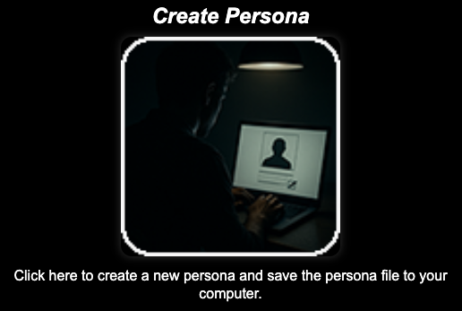
</p>

When you click this button, you are redirected to the **Create Persona** page. A new, blank persona is created automatically from the persona template, so it always reflects the current field structure.

<p align="center">
  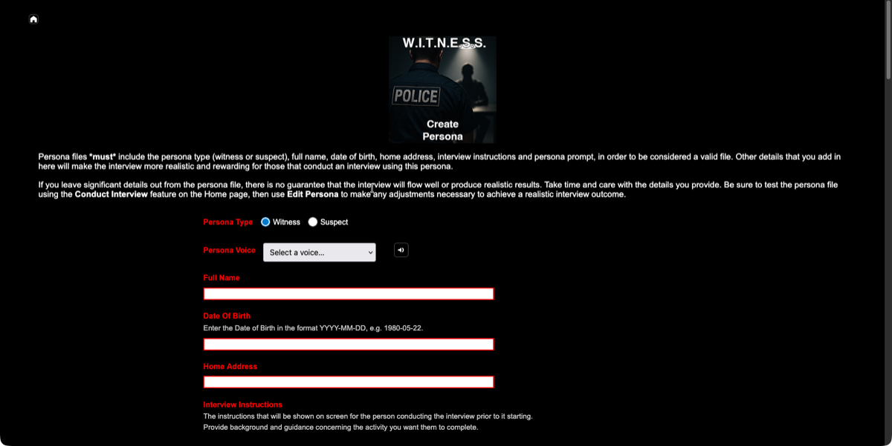
</p>

You can then start entering information. Fields are grouped into sections:

### 6.1 Required fields

These 7 fields must be completed for the persona to be usable:

| Field | Description |
|-------|-------------|
| **Persona Type** | `Witness` or `Suspect` |
| **Persona Voice** | Select a voice from the pop-up menu. If you click the speaker icon 🔊you can hear a brief comment from the voice you have selected. |
| **Full Name** | The persona's complete name |
| **Date of Birth** | The persona's date of birth |
| **Home Address** | The persona's home address |
| **Interview Instructions** | Guidance for the interviewer concerning who and why they need to interview this persona |
| **Persona Prompt** | The scenario context — this is what the AI uses to understand the situation |

### 6.2 Personal and contact details

These optional fields provide additional background that can be drawn upon during an interview:

| Field | Description |
|-------|-------------|
| **Employed By** | Name of the persona's employer |
| **Occupation** | Job title or role |
| **Business Address** | Workplace address |
| **Home Phone** | Home telephone number |
| **Work Phone** | Work telephone number |
| **Cell Phone** | Mobile telephone number |
| **Ethnicity** | The persona's ethnicity |
| **Gender** | The persona's gender |
| **Email** | Email address |
| **Social Networking** | Social media handles or platforms used |

### 6.3 Facts to Provide

This is the most important section. Each fact has three fields to complete:

- **Fact** — What the persona knows (e.g., "The car was a light grey Mazda2")
- **Certainty** — How confident they are (e.g., "Certain" or "Unsure"). If you have decided to create a suspect, then a third option ("Lie") becomes available.
- **Reason** — Why they have that level of certainty (e.g., "I was standing right next to it") or what the truth is in relation to the lie.

<br>

<p align="center">
  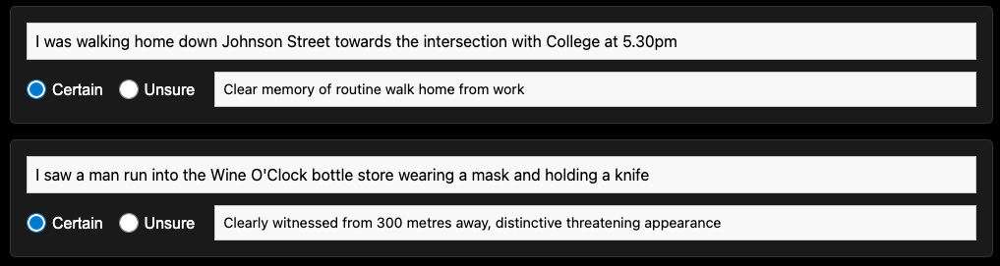<br><i>An example of facts entered into a persona file related to a witness</i>
</p>

<br>

<p align="center">
  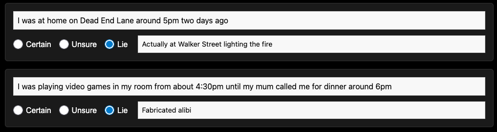<br><i>An example of facts entered into a persona file related to a suspect</i>
</p>
<br>

> **Tip:** The more structured and specific your facts are, the more consistent and realistic the interview responses will be.

### 6.4 Optional / Behavioural fields

These fields shape personality and interview dynamics without being revealed to the AI directly:


> [!IMPORTANT]
> The following behavioural fields have little impact on voice when using Piper TTS in the current version of the W.I.T.N.E.S.S. system. You will need to review other text-to-speech software that includes more accents, emotions and vocal quirks, and incorporate that software into the W.I.T.N.E.S.S. system in order to improve the vocal performance of the personas.

- **Speaking Speed / Tone / Accent** — influence TTS delivery
- **Vocal Quirks** — influence TTS delivery
- **Interaction Style** — e.g., cooperative, evasive, nervous
- **Emotional State** — e.g., distressed, calm, angry
- **Level of Education / Trust in Authority** - how well and willing the AI is to respond
- **Trigger Topics** — topics that make the witness evasive or affect the way in which the AI might behave

<p align="center">
  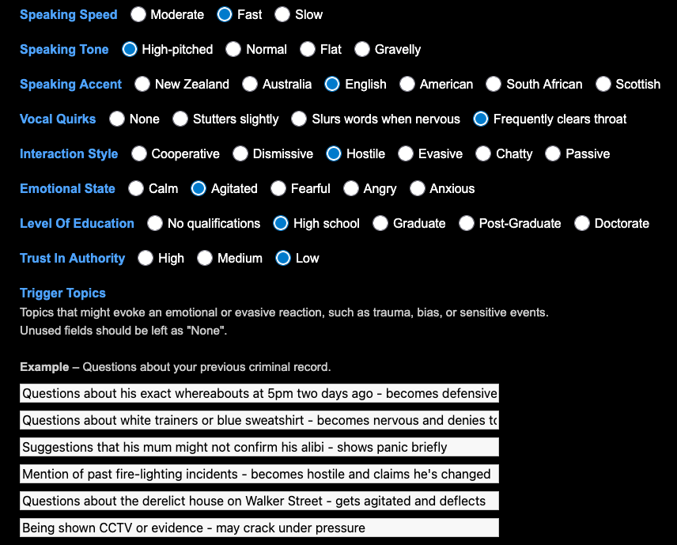
</p>

### 6.5 Saving (exporting) the persona as a file

Click **Export Persona** at the bottom of the page. The file is saved to your computer using the naming convention `Firstname-Lastname-YYYY-MM-DD.json`.

<p align="center">
  
</p>

<p align="center">
  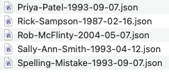
</p>

---

## 7. Edit a Persona

From the Home page, click **Edit Persona**

<p align="center">
  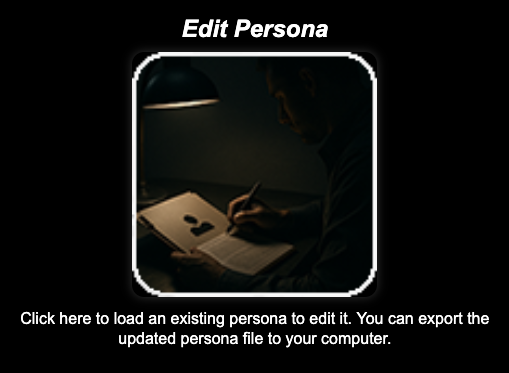
</p>

Select the persona file that you want to edit.

The persona file will then be checked to make sure it is a valid file.

- If there are no issues with the persona file, the browser will automatically redirect to the **Edit Persona** page.
- If there is an issue with the persona file, you will be informed what the issue is, before being given the choice to **Proceed** or **Cancel**

<p align="center">
  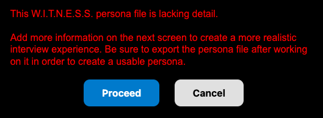<br><i>An example of a warning that a persona file that is being edited has issues</i>
</p>

The **Edit Persona** page will then pre-populate with all existing values.

> [!IMPORTANT]
> If you have loaded a persona with missing fields or is an older version of the persona structure, moving to this page effectively "fixes" the issues with the persona file, by adding in any missing fields. It is **VITAL** that you then export a new version of the persona (after making any additional changes) so that you end up with a new and valid version of the persona.

The **Edit Persona** page is identical to the **Create Persona** page. Any fields that exist in the template but are missing from the loaded persona file are automatically displayed so they can be filled in. Exporting this version of the persona file effectively repairs and updates the persona file to the current valid structure.

<p align="center">
  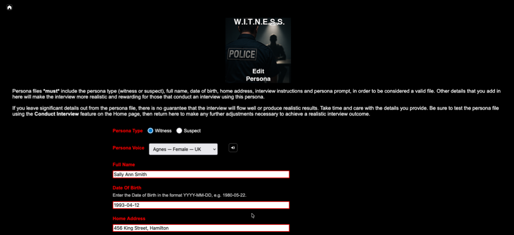
</p>

### 7.1 Saving changes

Click **Export Persona** at the bottom of the page. The updated file is saved to your computer using the naming convention `Firstname-Lastname-YYYY-MM-DD.json`.

<p align="center">
  
</p>

> **Note:** The system does not overwrite your original file — it always downloads a new copy. Replace your original file manually if needed.

### 7.2 Cancelling edits

Click **Cancel** to return to the Home page without saving. You will be asked to confirm that you want to do this before leaving (if you have made changes) as you will lose the changes you made if you haven't exported the persona.


## 8. Conduct Interview - Loading a persona

Click **Conduct Interview**

<p align="center">
  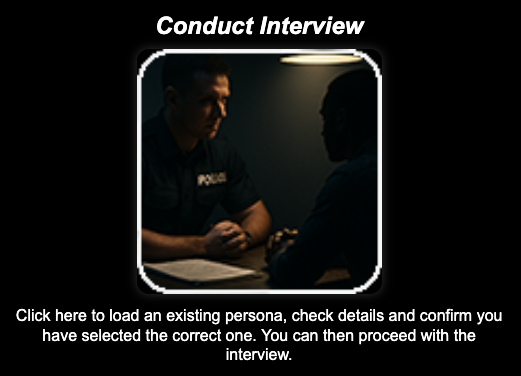
</p>

Select the persona file that you want to use.

<p align="center">
  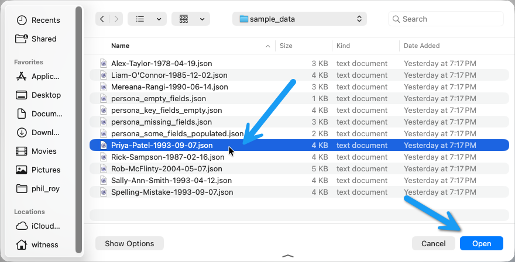
</p>

W.I.T.N.E.S.S. will validate the file and if it is able to be used for an interview, basic information concerning the witness/suspect will be displayed as a final check that you have selected the correct persona.

<p align="center">
  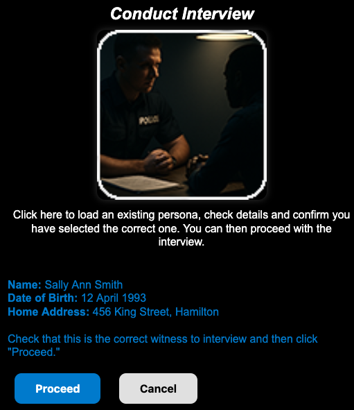
</p>

Click **Proceed** and you will be redirected to the **Conduct Interview** page.

The page displays the following (see image below):
1. Who you are about to conduct an interview with and today's date.
2. Background and instructions for the person conducting the interview, as well as information explaining how the interview transcript can be exported.
3. A message indicating that either the AI persona is warming up (which occasionally happens) or that it is ready.
4. The dual **START Interview** button, with the left part of the button being where you click to conduct a text only interview.
5. The dual **START Interview** button, with the right part of the button being where you click to conduct an audio interview.
6. The **Cancel** button if you want to back out of the interview at this point.

<p align="center">
  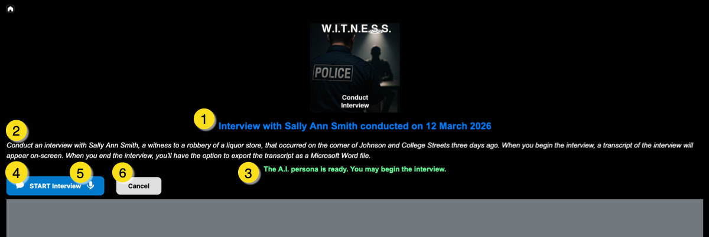
</p>

---

### 8.1 Conducting an Interview — Text Mode

The START Interview button has two sides — click the **left side** (speech bubble icon) to interview in text mode.

<p align="center">
  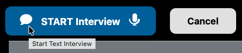
</p>

Once started:
- The **START Interview** button is replaced with **END Interview**
- A text input box appears where you type your questions to the AI. You can press the **ENTER** key on your keyboard to ask the question or...
- Click **Send** to ask your question
- "Interview commenced at [time]." will appear in the transcript window

<p align="center">
  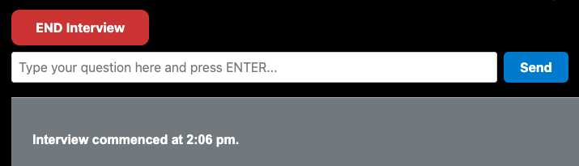
</p>

### Asking questions via text

1. Type your question in the text input box
2. Press **Enter** on your keyboard or click **Send**
3. The persona's response appears in the conversation panel below this area

<p align="center">
  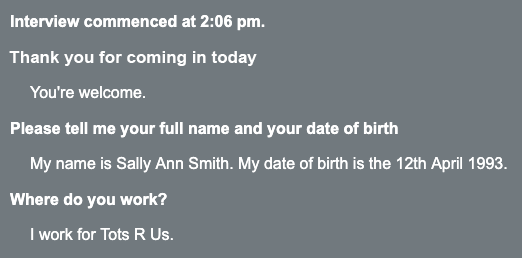
</p>

---

### 8.2 Conducting an Interview — Voice Mode

The START Interview button has two sides — click the **right side** (microphone icon) to interview in voice mode.

<p align="center">
  
</p>

Once started:
- The **START Interview** button is replaced with **END Interview**
- A **Press to talk** button appears for when you want to ask a question
- "Interview commenced at [time]." will appear in the transcript window

<p align="center">
  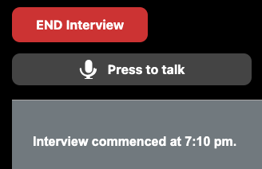
</p>

### Asking questions via voice

1. Click and hold **Press to talk**. The microphone button will turn blue.
2. Speak your question clearly
3. Release **Press to talk** to stop recording your question. The audio is sent for transcription automatically.

<p align="center">
  
</p>

### What happens next

1. Your spoken question is transcribed and appears in the conversation panel
2. The question is sent to the AI persona, who considers their response.
3. The response is spoken aloud by the persona's voice
4. The spoken response also appears as text in the conversation panel

> **Note:** If the AI requires time to consider their response (such as with open-ended or complex questions) you will see the word "Thinking" appear on screen whilst it formulates its reply.

> **Tip:** Speak at a natural pace in a quiet environment. The system uses Voice Activity Detection (VAD) to trim silence, so there is no need to press anything after speaking — just release the button.

---

### 8.3 Ending an interview

Click **END Interview** when you have asked all the questions you want to ask.

<p align="center">
  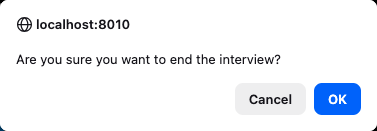
</p>

You have two options at this point:
- **Cancel** to continue the interview
- **OK** - "Interview concluded at [time]." will be added to the transcript. You will be asked if you want to save a copy of the transcript:
  -  **Cancel** - No transcript is exported
  -  **OK** - A Word document version of the transcript is saved to your computer using the naming convention `Interview-Firstname-Lastname-YYYY-MM-DD.docx` where the date is the date the the interview took place.

<p align="center">
  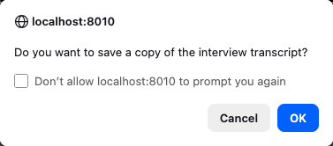
</p>

### 8.4 Recommencing an interview

If you realise you need to ask more questions, you can click the **START Interview** again. You will be asked to confirm that you want to recommence the interview.

<p align="center">
  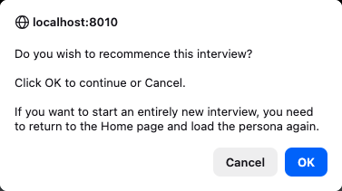
</p>

The transcript will state "Interview recommenced at [time]" if you click **OK**.

### 8.5 Final warning concerning the transcript

If you have opted not to export the transcript, you will receive one final warning when you attempt to move away from this page.

<p align="center">
  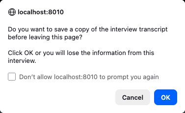
</p>

You have two options:
- **Cancel** will return you to the Home page without saving a copy of the transcript.
- **OK** - Will save a copy of the transcript.

---

## 9. Admin Tools

Admin Tools provides access to tools for system maintenance and configuration. It is intentionally hidden from the main navigation and must be accessed via direct link.

**Admin Tools URL:** `http://localhost:8010/admin/`

---

### 9.1 Admin Dashboard

The dashboard provides a central index of all admin tools with brief descriptions. It uses a white background (unlike the rest of the system) for easy reading.

From here you can navigate to:
- System Check
- Voice Demonstrations
- Custom Dictionary

<p align="center">
  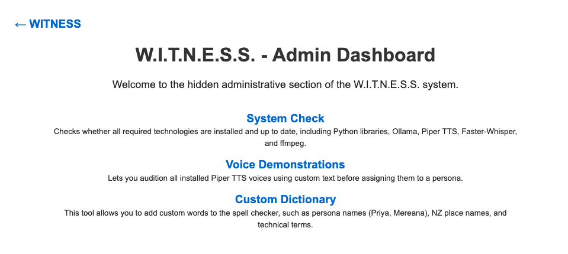
</p>

The main page of the Admin Dashboard has a link back to the Home page of the W.I.T.N.E.S.S. system.

---

### 9.2 System Check

Displays the installed version of every key dependency — Python packages, system tools, and AI models, as well as information that an administrator can add as notes related to any software installation decisions.

Use this page to:
- Verify all components are installed correctly after initial setup
- Confirm version numbers when reporting issues
- Check that Ollama and the LLM are available

<p align="center">
  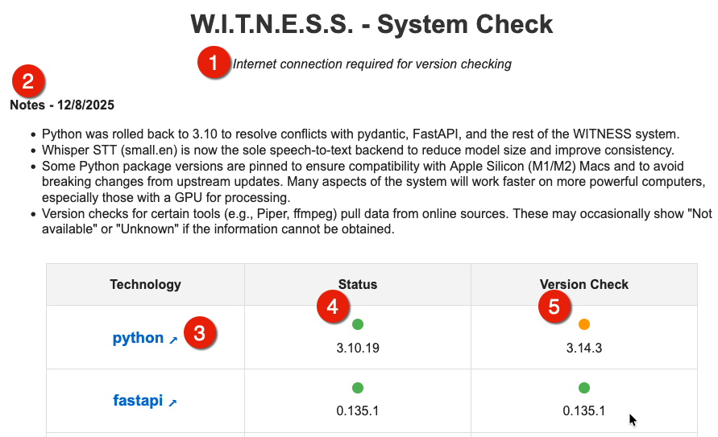
</p>

In the image above, you can see:
1. A reminder that an internet connection is needed in order for the system update feature to function.
2. Notes stored in a file that an administrator can modify, to help with any future system checks or updates. The file path for this file is `/frontend/admin/system-check-notes.txt`
3. The technology being checked, as well as a clickable link to the home page or repository for this software
4. The **Status** column shows whether each component was found: 🟢 detected, 🔴 not detected.
5. The **Version Check** column compares the installed version against the latest available: 🟢 current, 🟠 a newer version exists but the difference is not significant, 🔴 the installed version is significantly outdated.

> **Note:** Caution needs to be applied when considering updating any dated software. The update can have significant impact on the performance of the W.I.T.N.E.S.S. system.

---

### 9.3 Voice Demonstrations

Lists all available voices and lets you preview each one. The voice details (accent, age range, gender, notes) are shown alongside each entry.

<p align="center">
  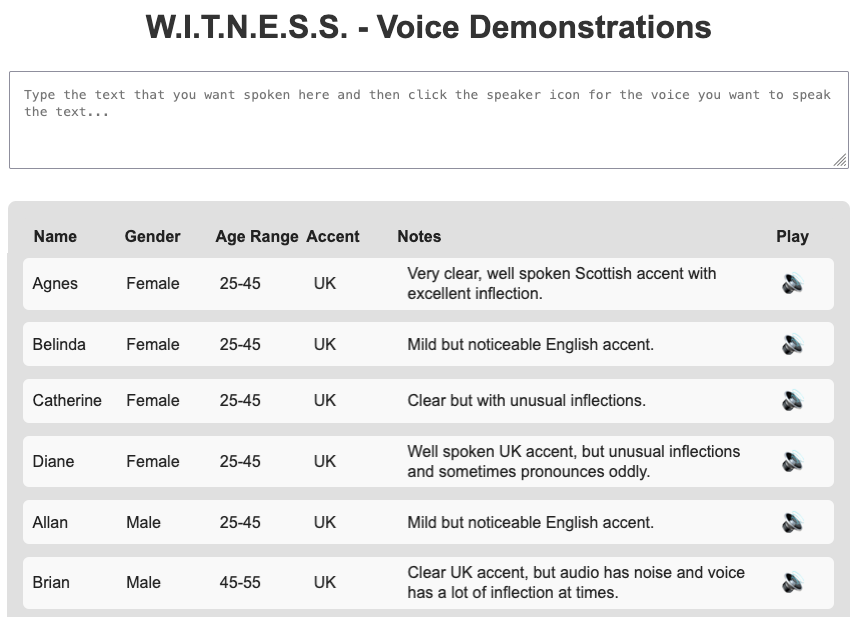
</p>

Previewing a voice:

1. Enter a phrase into the text box for the voices to speak out loud
2. Find the voice you want to preview
3. Click the speaker icon 🔊 — the voice speaks the phrase you typed in

Use this page to choose voices for your personas before editing or creating persona files. Note the name shown for each voice — this is the value to select when creating a persona.

---

### 9.4 Custom Dictionary

Manages the two word lists that power the persona spell checker.

<p align="center">
  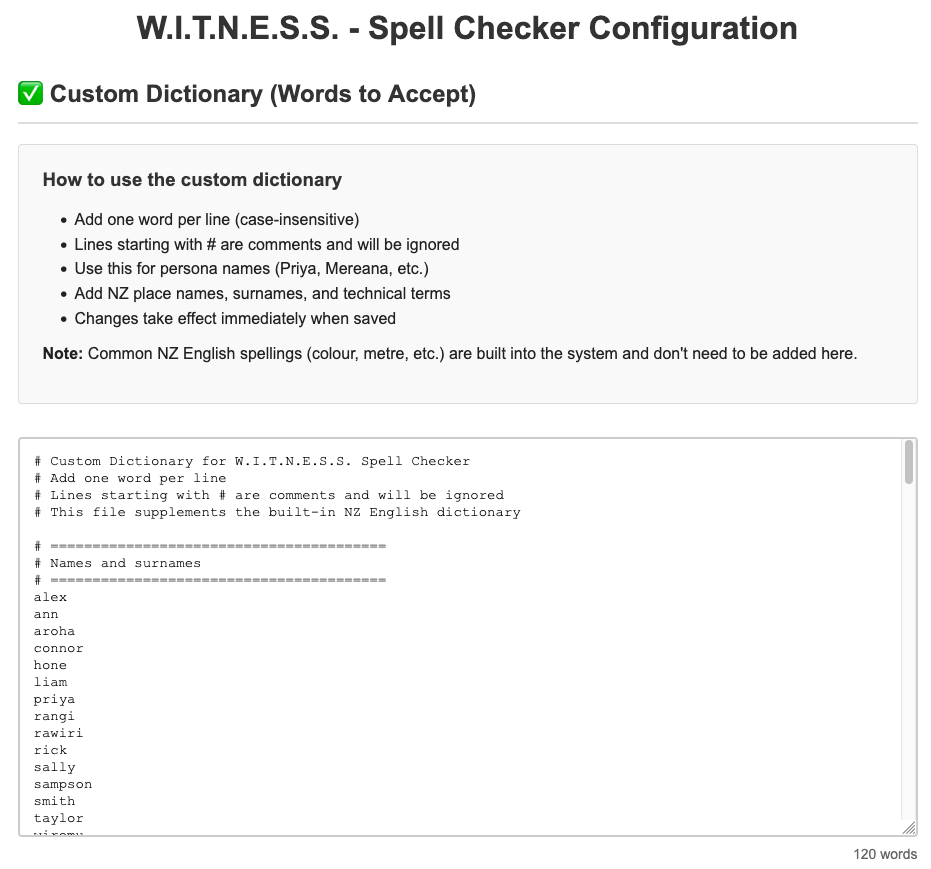
</p>

#### Custom Dictionary (`custom_dictionary.txt`)

Words added here are treated as correctly spelled and will not be flagged during persona validation. Add:
- Persona names (e.g., `Mereana`, `McFlinty`)
- New Zealand place names (e.g., `Ōtautahi`, `Whangārei`)
- Māori words and terms
- Technical or domain-specific vocabulary

#### Suspicious Words (`suspicious_words.txt`)

Valid English words that should still trigger a warning during validation — typically common typos that happen to be real words (e.g., `pubic` instead of `public`, `manger` instead of `manager`).

#### Editing the lists

Both lists are editable directly in the text areas on the page. Enter one word per line.

Click **Save Dictionary** or **Save Suspicious Words** to write changes to disk. Changes take effect immediately without needing to restart the W.I.T.N.E.S.S. system.

<p align="center">
  
</p>

> **Note:** Both files (`custom_dictionary.txt` and `suspicious_words.txt`) are plain text files located in `backend/`. They can also be edited directly in any text editor.

---

## 10. Tips for Realistic Interviews

### Writing effective persona prompts

The `persona_prompt` field is the scenario briefing given to the AI. Write it as a clear, third-person description of who the person is and what they witnessed or experienced. However you do not need to include all the relevant information. Think of it as telling the AI what role it is about to play.

Include:
- Who they are
- Where they were and why
- What they saw, heard, or did

### Facts to provide - Using certainty and reason fields

The `certainty` and `reason` fields on each fact significantly affect how the persona responds under questioning. A fact marked as `certain` with the reason `"I was standing right next to it"` will produce a more assertive, detailed answer than one marked `unsure` with `"It was dark and I only saw it briefly"`.

### Starting interviews

Open with broad questions to let the persona describe the incident in their own words before moving to more specific questioning. Narrow questions early can produce terse answers.

### Trigger topics

If the persona has `trigger_topics` set, asking about those topics will cause the witness to become evasive or less forthcoming. This is useful for training interviewers to recognise reluctant witnesses.

---

*W.I.T.N.E.S.S. — Developed by Philip Roy — https://www.bluengrey.com*
